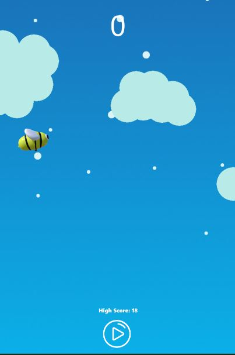
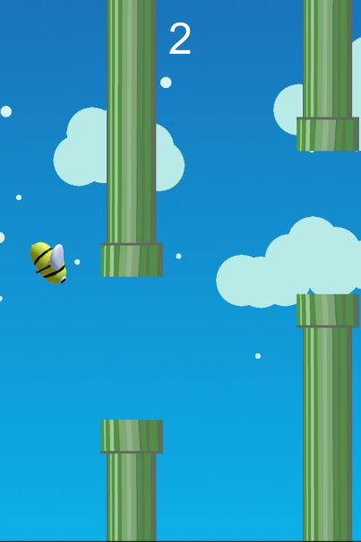
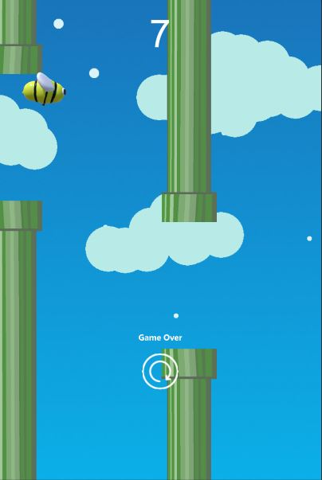

# smeerws-TappyBee

TappyBee was implemented along the tutorial: Develop and Publish Flappy Bird in 3 Hours With Unity3D

https://www.youtube.com/watch?v=A-GkNM8M5p8&index=57&list=WL&t=6280s

In this tutorial the following points are covered

+ Practicing C# Fundamentals
+ Using Sprites
+ Implementing a Score
+ Implementing Parallax
+ Using UnityEngine.UI
+ Practicing Rotation, Using Transform, etc. 

Screenshots

